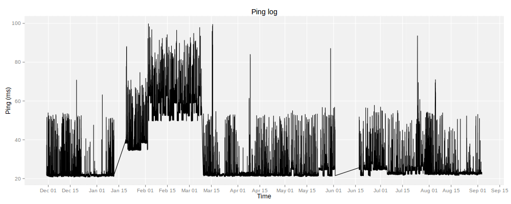

# pingplot

plot a ping log to pdf, svg or png. Can be used for monitoring network performance over a longer time period

## sample output

Small time frame:

Larger time frame:

## setup

1. add this line to `crontab -e`

    `@reboot while true; do ping google.com -D -i 60; sleep 5; done >> ~/pinglog`

	where `60` is your ping delay in seconds and `google.com` is the target server
2. link your pinglog into this directory
3. either run `./pingplot.sh png` or call `pingplot.php?fmt=png`

